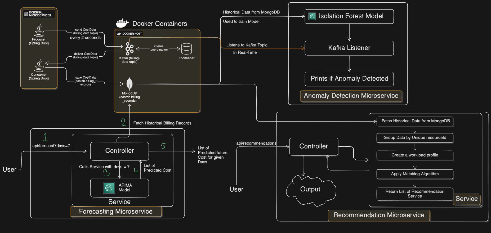
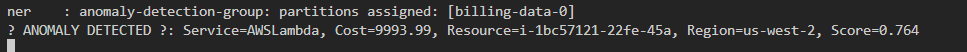
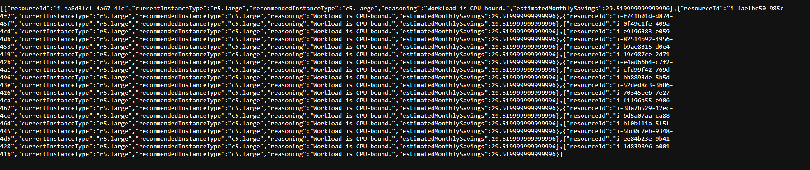

# AI-Powered Cloud Cost Optimizer

## Overview
This project is a backend system designed to help companies reduce their cloud spending on platforms like **AWS**, **GCP**, or **Azure**.  
It moves beyond simple cost reporting by using a **microservice architecture** and **machine learning** to proactively forecast future costs, detect spending anomalies in real time, and recommend specific, actionable changes to optimize resource allocation.

The entire system is built on an **event-driven architecture** using **Apache Kafka** to stream billing and performance data between independent, specialized services.

---

## The Problem and Our Solution

### The Problem
Companies regularly overspend by **20–40%** on cloud resources due to overprovisioning, idle resources, and inefficient scaling.  
Current solutions like **AWS Cost Explorer** are reactive — they show what you’ve already spent, but they don’t help prevent future overspending.

### Our Solution
This project provides a **proactive, AI-driven solution**.  
It acts as an **intelligent financial advisor** for cloud infrastructure by providing three key capabilities that traditional dashboards lack:

- **Forecasting:** Uses time-series ML models like **ARIMA** to predict future spending for better budget planning.  
- **Real-Time Anomaly Detection:** Uses models like **Isolation Forest** to monitor live cost data and alert on unusual spikes.  
- **Intelligent Recommendations:** Analyzes performance profiles (CPU, Memory) to provide **“right-sizing”** recommendations — suggesting cheaper instance types that better match workloads and reduce costs.

---

## Features
- **Real-Time Data Ingestion:** Scalable data pipeline built with **Spring Boot** and **Apache Kafka** to ingest and process billing data.  
- **AI-Powered Cost Forecasting:** API endpoint providing an *N-day forecast* of future cloud costs based on historical trends.  
- **Real-Time Anomaly Detection:** Streaming service that monitors costs as they happen and prints alerts when anomalies are detected.  
- **Intelligent Right-Sizing Recommendations:** API endpoint that returns a list of overprovisioned **EC2 instances**, suggesting cost-effective alternatives and estimated monthly savings.

---

## Tech Stack
- **Backend:** Java 17, Spring Boot 3  
- **Messaging/Streaming:** Apache Kafka  
- **Database:** MongoDB  
- **Machine Learning Libraries:**
  - Forecasting: `com.github.signaflo:timeseries` (ARIMA Model)
  - Anomaly Detection: `io.github.haifengl:smile-core` (Isolation Forest)
- **Containerization:** Docker, Docker Compose  
- **Build Tool:** Apache Maven  

---

## System Architecture
The system consists of **four independent microservices** communicating through a central **Kafka topic** and using **MongoDB** for persistence.
 

---

## Project Demo

### Anomaly Detection in Action
The system successfully identifies an anomalous cost spike in the real-time data stream.
 

### Right-Sizing Recommendations
The recommendation engine analyzes workload profiles and suggests more cost-effective instance types.
 

---

## Getting Started
Follow these instructions to get the project running on your local machine.

### Prerequisites
- Java 17 JDK  
- Apache Maven  
- Docker Desktop  

---

## Running the Project
The project contains **four microservices** that must be run in the correct order.

### 1. Clone the Repository:
`git clone <your-repo-url>`

### 2. Start the infrastructure
Navigate to the root directory of the project (where docker-compose.yml is located) and run:
`docker-compose up -d`
This will start the Kafka, Zookeeper, and MongoDB containers.

### 3. Start the data pipeline:
Open two separate terminals.
- In the first terminal, navigate to the producer-service folder and run: `mvn spring-boot:run`
- In the second terminal, navigate to the consumer-service folder and run: `mvn spring-boot:run`
- Let these run for at least 1-2 minutes to generate sufficient historical data.

### 4. Start the analytical services:
You can now start the other services in any order in new terminals.
- Navigate to forecasting-service and run: `mvn spring-boot:run`
- Navigate to anomaly-detection-service and run: `mvn spring-boot:run`
- Navigate to recommendation-service and run: `mvn spring-boot:run`

### 5. Test the API Endpoints:
- Get Forecast: `http://localhost:8082/api/forecast?days=7`
- Get Recommendations: `http://localhost:8084/api/recommendations`
- View Anomaly Alerts: Watch the console output of the anomaly-detection-service.

---

# Thanks !!

