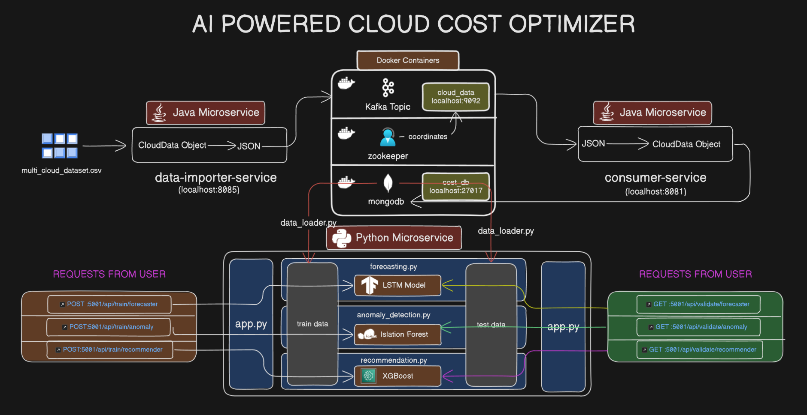
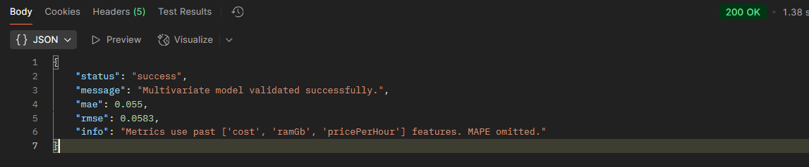
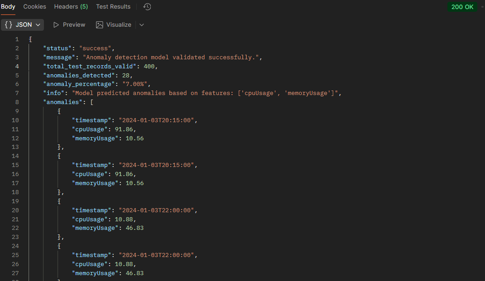
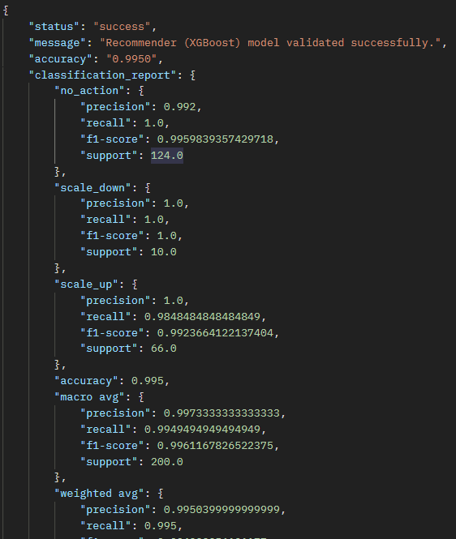

# **AI-Powered Cloud Resource Manager**

## **Overview**

This project implements an intelligent backend system designed to analyze cloud resource usage patterns, forecast costs, detect anomalies, and recommend optimal scaling actions. It moves beyond traditional reactive monitoring by leveraging machine learning models trained on real-world data to provide verifiable, proactive insights for cloud cost optimization and operational efficiency.

The system utilizes a hybrid microservice architecture, combining Java/Spring Boot for robust data ingestion via Kafka and MongoDB, and Python/Flask for advanced ML analytics using TensorFlow, Scikit-learn, and XGBoost.

## **The Problem**

Cloud platforms offer flexibility but often result in significant overspending due to overprovisioning and inefficient resource allocation. Standard cloud monitoring tools typically provide historical dashboards, lacking predictive capabilities or actionable, data-driven recommendations for optimization based on specific workload behavior. Validating optimization strategies also requires realistic data and quantifiable results.

## **Solution**

This project provides a data-driven solution featuring:

1. **Real-World Data Pipeline:** Ingests and processes a large Kaggle dataset ("Multi-Cloud Resource Dataset") representing dynamic cloud workloads using Java, Kafka, and MongoDB.  
2. **ML Analytics Engine (Python):** A dedicated service performs:  
   * **Cost Forecasting:** An LSTM deep learning model predicts future costs based on historical cost, RAM, and price-per-hour trends.  
   * **Anomaly Detection:** An Isolation Forest model identifies unusual operational behavior based on CPU and Memory usage patterns.  
   * **Scaling Recommendations:** An XGBoost classifier predicts optimal scaling actions (`scale_up`, `scale_down`, `no_action`) based on current CPU/Memory usage and allocated vCPU/RAM.  
3. **Verifiable Results:** All models are rigorously trained and validated using a time-based 80/20 split on the real dataset, providing quantifiable metrics (MAE, RMSE, Anomaly %, Accuracy).

## **System Architecture**

## **Tech Stack**

* **Backend:** Java 17, Spring Boot 3  
* **Machine Learning:** Python 3.11, Flask, Pandas, NumPy  
* **ML Libraries:** TensorFlow/Keras, Scikit-learn, XGBoost, Joblib  
* **Messaging:** Apache Kafka  
* **Database:** MongoDB  
* **Infrastructure:** Docker, Docker Compose

## **Features**

* **Data Ingestion:** Processes and stores large-scale time-series cloud usage data.  
* **Cost Forecasting:** Predicts future costs using a validated LSTM model.  
* **Anomaly Detection:** Identifies statistically significant deviations in CPU/Memory usage using Isolation Forest.  
* **Intelligent Scaling Recommendations:** Predicts appropriate scaling actions (`scale_up`/`scale_down`/`no_action`) using a high-accuracy XGBoost classifier.  
* **API-Driven:** Exposes REST endpoints for training and validating ML models.

## **Dataset Used**

* [**Multi-Cloud Resource Dataset (Kaggle)**](https://www.kaggle.com/datasets/freshersstaff/multi-cloud-resource-dataset)**:** Contains \~1000 (limited for dev) time-series records of multi-cloud workload activity, including usage metrics, configuration, cost, and scaling actions.

## **Key Results (Based on Test Set Validation)**

* **Forecasting Model (LSTM):** Achieved an MAE of **\[0.0550\]** and RMSE of **\[0.0583\]** in predicting hourly cost.

* **Anomaly Detection Model (Isolation Forest):** Successfully identified **\[7.00%\]** of test records as anomalous based on CPU/Memory usage.  

* **Recommendation Model (XGBoost):** Predicted the correct scaling action with **\[99.50%\]** accuracy on unseen data.

## **Setup & Running Instructions**

### **Prerequisites**

* Java 17+ JDK & Maven  
* Python 3.10+ & Pip  
* Docker & Docker Compose

### **Running the System**

1. **Start Infrastructure (Docker):**  
   * Navigate to the project root directory.  
   * Run `docker-compose up`. This starts Kafka, Zookeeper, and MongoDB. Leave this running.  
2. **Start Java Data Pipeline (Local):**  
   * Open a **new terminal**. Navigate to `consumer-service` and run `mvn clean spring-boot:run`. Leave running.  
   * Open **another new terminal**. Navigate to `data-importer-service` and run `mvn clean spring-boot:run`. Wait for it to import data (prints success message).  
3. **Start Python ML Service (Local):**  
   * Open **another new terminal**. Navigate to `ml-analytics-service`.  
   * Activate virtual environment:  
     * Windows: `venv\Scripts\activate`  
     * Mac/Linux: `source venv/bin/activate`  
   * Install dependencies: `pip install -r requirements.txt`  
   * Run the server: `python app.py`. Leave running.

## **API Endpoints (ML Service \- http://localhost:5001)**

* **`POST /api/train/forecaster`**: Trains the LSTM cost forecasting model.  
* **`GET /api/validate/forecaster`**: Validates the forecaster and returns MAE/RMSE.  
* **`POST /api/train/anomaly`**: Trains the Isolation Forest anomaly detection model.  
* **`GET /api/validate/anomaly`**: Validates the anomaly detector, returns anomaly count/percentage and details.  
* **`POST /api/train/recommender`**: Trains the XGBoost scaling recommendation model.  
* **`GET /api/validate/recommender`**: Validates the recommender and returns accuracy/classification report.  
* **`GET /api/test-mongo`**: Tests connection to MongoDB and retrieves a sample record.

